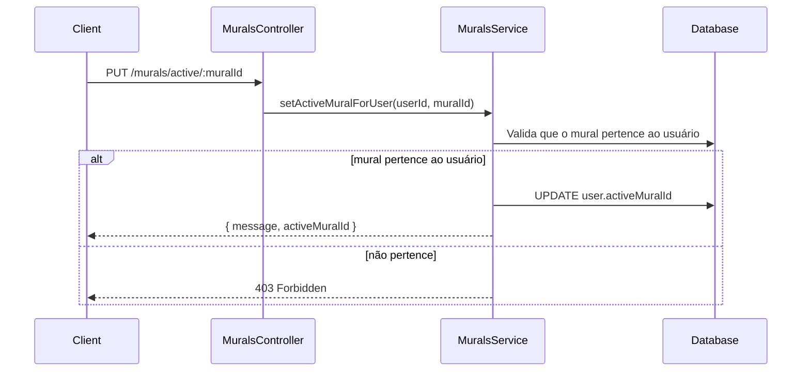

# Mural Ativo

## Visão geral

O **"Mural Ativo"** representa qual mural o usuário está editando no momento. Ele resolve o problema de contexto quando um usuário possui múltiplos murais: o backend persiste a escolha para manter o contexto consistente entre sessões e dispositivos.

A decisão de persistir essa informação no banco (e não apenas no frontend) está registrada em [ADR: Persistência do mural ativo](../adr/active-mural-persistence.md).

## Componentes

### Entidade (`UserEntity` — `src/users/entities/user.entity.ts`)

```typescript
@Column({ type: 'uuid', nullable: true })
activeMuralId: string | null;

@ManyToOne(() => MuralEntity, { nullable: true })
@JoinColumn({ name: 'activeMuralId' })
activeMural: MuralEntity | null;
```

O campo é `nullable` para manter retrocompatibilidade com usuários existentes. O schema é sincronizado automaticamente pelo TypeORM (`synchronize: true`) em desenvolvimento — não há migration dedicada.

### Service (`MuralsService` — `src/murals/murals.service.ts`)

- `findAllByUser(userId)`: lista os murais do usuário e indica qual é o ativo.
- `setActiveMuralForUser(userId, muralId)`: valida que o mural pertence ao usuário e atualiza `activeMuralId`.
- `create(userId, dto)`: ao criar um mural, se o usuário ainda não tiver um mural ativo, define o novo como ativo.
- `delete(...)`: se o mural removido for o ativo, define o próximo mural disponível como ativo (ou `null`).

### Controller (`MuralsController` — `src/murals/murals.controller.ts`)

| Método | Endpoint                  | Descrição                              | Auth |
| ------ | ------------------------- | -------------------------------------- | ---- |
| `GET`  | `/murals/user`            | Lista os murais do usuário autenticado | JWT  |
| `PUT`  | `/murals/active/:muralId` | Define o mural ativo                    | JWT  |

**`GET /murals/user`** retorna:

```json
{
  "murals": [
    { "id": "uuid", "name": "meu-mural", "displayName": "Meu Mural", "isActive": true }
  ],
  "activeMuralId": "uuid"
}
```

**`PUT /murals/active/:muralId`** retorna:

```json
{ "message": "...", "activeMuralId": "uuid" }
```

Erros: `404` (mural não existe) e `403` (mural não pertence ao usuário).

### Resposta de autenticação (`AuthService` — `src/auth/auth.service.ts`)

`register`, `login` e `validate` incluem `activeMuralId` dentro do objeto `user` da resposta (`AuthResponseDto` / `ValidateResponseDto`), para que o cliente saiba imediatamente qual mural usar.

## Como funciona

O `activeMuralId` é um único campo na entidade do usuário, mantido consistente em todos os pontos que criam, removem ou trocam murais. O ciclo de vida:

- **Registro:** o backend cria um mural padrão (nome derivado do email) e o define como ativo. A resposta de registro já inclui o `activeMuralId`.
- **Login:** a resposta inclui o `activeMuralId` persistido; o cliente o utiliza nas operações subsequentes.
- **Criação de mural adicional:** se `activeMuralId` estiver `null`, o novo mural é definido como ativo automaticamente.
- **Troca de mural:** `PUT /murals/active/:muralId` valida a posse e atualiza o campo.
- **Deleção:** existe um mínimo de 1 mural por usuário (o último não pode ser removido); se o mural deletado for o ativo, o próximo disponível assume.

### Regras de negócio

- **Mínimo de 1 mural:** o usuário não pode deletar o último mural.
- **Mural padrão no registro:** todo novo usuário recebe um mural automaticamente, já definido como ativo.

### Fluxo de troca de mural ativo


