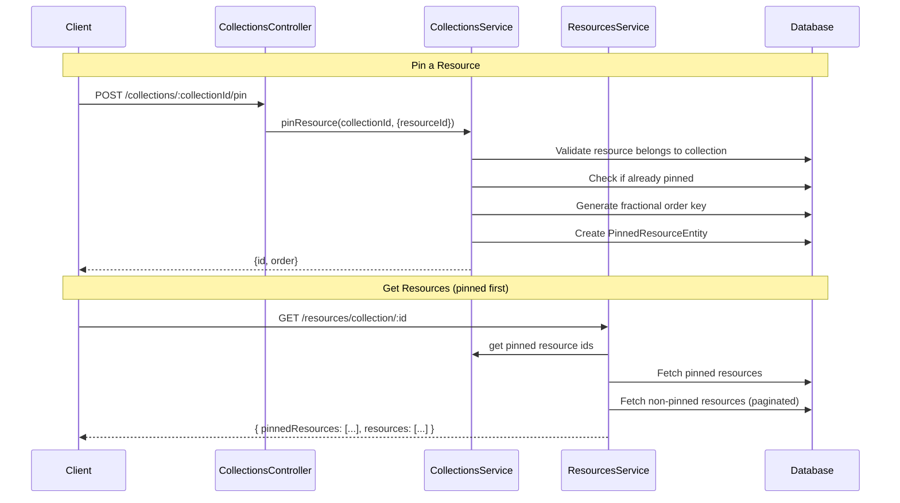

# Pinned Resources

## Overview

Allows a user to "pin" resources to the top of a collection feed, similar to pinning posts on social networks. Pinned resources are always returned before the regular (paginated) resources, in an explicit, reorderable order.

## Components

### Entities

- `PinnedResourceEntity` (`src/collections/entities/pinned-resource.entity.ts`): join table between `Collection` and `Resource`, with an `order` column that uses fractional indexing so resources can be reordered without rewriting siblings.

### DTOs

- `PinResourceDto` (`src/collections/dto/pin-resource.dto.ts`): `{ resourceId: string }`
- `ReorderPinnedResourceDto` (`src/collections/dto/reorder-pinned-resource.dto.ts`): `{ newOrder: string }`

### Service (`CollectionsService` — `src/collections/collections.service.ts`)

- `pinResource(collectionId, dto)`: validates the resource belongs to the collection, rejects an already-pinned resource (`BadRequestException`), generates the next fractional order key, and creates the `PinnedResourceEntity`.
- `unpinResource(collectionId, resourceId)`: removes the pin (`NotFoundException` if it does not exist).
- `reorderPinnedResource(pinnedId, dto)`: updates the `order` of an existing pin.

### Controller (`CollectionsController` — `src/collections/collections.controller.ts`)

| Method   | Endpoint                             | Description             | Auth |
| -------- | ------------------------------------ | ----------------------- | ---- |
| `POST`   | `/collections/:collectionId/pin`     | Pin a resource          | JWT  |
| `DELETE` | `/collections/:collectionId/unpin/:resourceId` | Unpin a resource | JWT  |
| `PATCH`  | `/collections/pinned/:pinnedId/reorder` | Reorder a pinned resource | JWT |

## How it works

Pinning validates ownership and dedupes, then assigns a fractional `order` key derived from the current highest-ordered pin in the collection. Reads merge the two sets: pinned resources first (ordered by their `order` key), then the regular paginated resources. `ResourcesService` consumes the pinned IDs from `CollectionsService` to compose this response — the pinned set is resolved separately from the paginated query to keep ordering deterministic and avoid a circular dependency between the two services.

## Data flow

