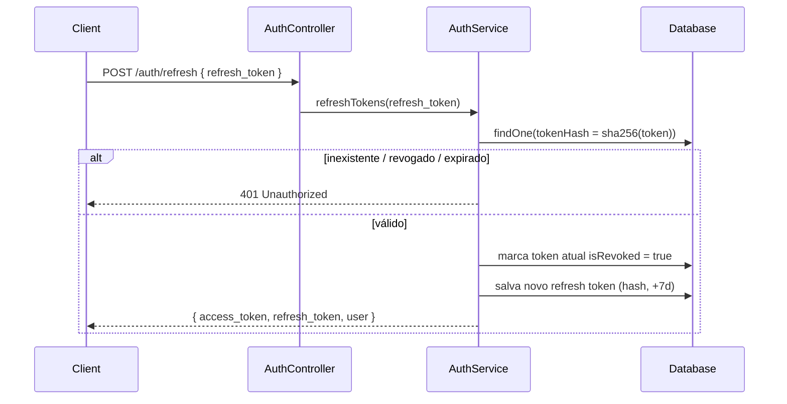

# Autenticação com Refresh Token

## Visão geral

O fluxo de autenticação usa **access tokens de curta duração** (JWT, ~15 min) combinados com **refresh tokens de longa duração** (~7 dias) para equilibrar segurança e experiência do usuário: o cliente renova o acesso sem novo login. Os refresh tokens são opacos, armazenados como hash no banco, com **rotação de uso único** e capacidade de revogação (logout). As rotas de autenticação são protegidas por rate limiting.

A decisão pelo token opaco com hash persistido (em vez de JWT stateless) está registrada em [ADR: Refresh tokens opacos](../adr/opaque-refresh-tokens.md).

## Componentes

### Entidade (`RefreshToken` — `src/auth/entities/refresh-token.entity.ts`)

```typescript
@Entity('refresh_tokens')
export class RefreshToken {
  @PrimaryGeneratedColumn('uuid') id: string;
  @Column() tokenHash: string;            // SHA-256 do token enviado ao cliente
  @Column({ default: false }) isRevoked: boolean;
  @Column() expiresAt: Date;
  @ManyToOne(() => UserEntity, (user) => user.refreshTokens, { onDelete: 'CASCADE' })
  user: UserEntity;
  @CreateDateColumn() createdAt: Date;
}
```

`UserEntity` tem a relação inversa `@OneToMany` (`refreshTokens`). O schema é sincronizado pelo TypeORM (`synchronize: true`) em desenvolvimento — sem migration dedicada.

### DTO

- `RefreshTokenDto` (`src/auth/dto/refresh-token.dto.ts`): `{ refresh_token: string }`, usado por `/auth/refresh` e `/auth/logout`.

### Service (`AuthService` — `src/auth/auth.service.ts`)

- `generateRefreshToken()`: gera um token opaco (`randomBytes(64)` em hex) e seu hash SHA-256. O token vai para o cliente; o hash é persistido.
- `login` / `register`: além do access token, geram e persistem um refresh token (validade 7 dias) e o retornam no corpo.
- `refreshTokens(refreshToken)`: busca pelo hash, valida (existe, não revogado, não expirado), **revoga o token usado** e emite um novo par access + refresh (rotação de uso único).
- `logout(refreshToken)`: marca o token como `isRevoked = true`.

### Controller (`AuthController` — `src/auth/auth.controller.ts`)

| Método | Endpoint         | Descrição                              | Proteção                |
| ------ | ---------------- | -------------------------------------- | ----------------------- |
| `POST` | `/auth/register` | Cria usuário e emite par de tokens     | `ThrottlerGuard` (5/min) |
| `POST` | `/auth/login`    | Valida credenciais e emite par de tokens | `ThrottlerGuard` (5/min) |
| `POST` | `/auth/refresh`  | Renova o par de tokens (rotação)        | —                       |
| `POST` | `/auth/logout`   | Revoga o refresh token                  | —                       |
| `GET`  | `/auth/validate` | Retorna o usuário autenticado           | `JwtAuthGuard`          |

### Rate limiting

`ThrottlerModule` é configurado em `src/app.module.ts`; `register` e `login` aplicam `@UseGuards(ThrottlerGuard)` com `@Throttle({ default: { limit: 5, ttl: 60000 } })` (5 tentativas por minuto) para mitigar brute-force.

## Como funciona

O access token é um JWT assinado de curta duração usado em cada requisição. Quando expira, o cliente chama `/auth/refresh` com o refresh token; o backend localiza o registro pelo hash SHA-256, valida e — por ser de uso único — revoga o token apresentado e emite um par novo. Assim, se um refresh token for roubado e usado, o uso legítimo seguinte falha (token já revogado), tornando o vazamento detectável. O logout simplesmente revoga o token daquela sessão, sem afetar as demais.

### Fluxo de refresh (rotação)


