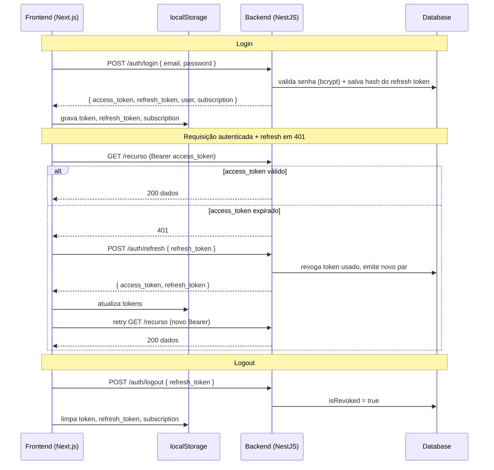

# Fluxo de autenticação (end-to-end)

## Visão geral

Descreve o fluxo de autenticação completo entre o frontend (`pinnn-me-web`, Next.js) e o backend (`pinnn-me-be`, NestJS): login/registro, validação de sessão, renovação (refresh) e logout. O modelo combina **access token** (JWT) com **refresh token** opaco rotacionado — ver a feature de backend em [Autenticação com Refresh Token](../features/refresh-token-authentication.md) e a decisão em [ADR: Refresh tokens opacos](../adr/opaque-refresh-tokens.md).

## Implementação

- **Plano de refatoração**: [auth-hardening](../../plans/auth-hardening.md)
- **Status**: Implementado, porém com pontos de melhoria abertos — inclui **1 bug crítico de segurança** (validação de senha inoperante). Ver "Pontos de melhoria" abaixo e o plano para o TODO priorizado.

## Componentes

### Backend (`pinnn-me-be`)

- [auth.controller.ts](../../../src/auth/auth.controller.ts) — rotas `register`, `login`, `refresh`, `logout`, `validate`.
- [auth.service.ts](../../../src/auth/auth.service.ts) — emissão de tokens, rotação e revogação.
- [strategies/jwt.strategy.ts](../../../src/auth/strategies/jwt.strategy.ts) — valida o JWT (Bearer) e carrega o usuário do banco a cada requisição.
- [guards/jwt-auth-guard.ts](../../../src/auth/guards/jwt-auth-guard.ts) — protege rotas autenticadas.
- [entities/refresh-token.entity.ts](../../../src/auth/entities/refresh-token.entity.ts) — refresh tokens (hash SHA-256, `isRevoked`, `expiresAt`).
- [credentials/credentials.service.ts](../../../src/credentials/credentials.service.ts) — hash/validação de senha (bcrypt).
- JWT assinado em [auth.module.ts](../../../src/auth/auth.module.ts); rate limiting (`ThrottlerModule`) em [app.module.ts](../../../src/app.module.ts).

### Frontend (`pinnn-me-web`)

- `src/components/providers/auth-provider/AuthProvider.tsx` — estado global de auth, `SignIn`/`SignOut`, hidratação e refresh no boot.
- `src/components/auth-guard.tsx` — proteção de rotas (client-side).
- `src/lib/api-client/helpers/request.ts` — fetcher com injeção de Bearer e **refresh automático em 401**.
- `src/lib/state/slices/authSlice.ts` — token/subscription no Redux.
- Tokens persistidos em `localStorage` (`token`, `refresh_token`, `subscription`).

## Passos do fluxo

1. **Login/Registro** — frontend envia credenciais para `POST /auth/login` (ou `/register`). O backend valida a senha (bcrypt), emite `access_token` (JWT) + `refresh_token` (opaco, hash salvo no banco, validade 7 dias) e retorna `{ access_token, refresh_token, user, subscription }`. O frontend guarda os três em `localStorage` e o token no Redux, e navega para `/dashboard`.
2. **Requisição autenticada** — o fetcher injeta `Authorization: Bearer <access_token>` lido do `localStorage`. A `JwtStrategy` valida o JWT e carrega o usuário (`{ id, email, role }`) do banco.
3. **Validação de sessão (boot)** — ao montar, o `AuthProvider` chama `GET /auth/validate`; se falhar e houver refresh token, chama `POST /auth/refresh` e revalida.
4. **Refresh (rotação)** — `POST /auth/refresh` localiza o token pelo hash, valida (existe, não revogado, não expirado), **revoga o token usado** e emite um novo par. O frontend tem refresh automático em 401 com guard `isRefreshing` para evitar chamadas simultâneas.
5. **Logout** — `POST /auth/logout` marca o refresh token como revogado; o frontend limpa `localStorage` e o estado e redireciona para `/login`.

## Diagrama

## Pontos de melhoria

Resumo da análise; o TODO acionável e priorizado está no plano [auth-hardening](../../plans/auth-hardening.md).

- 🔴 **Validação de senha inoperante (crítico).** `credentials.service.ts` faz `if (!bcrypt.compare(...))` **sem `await`** — `bcrypt.compare` retorna uma Promise (sempre truthy), então a checagem nunca falha e o login aceita **qualquer senha**.
- 🔴 **Tokens em `localStorage` (crítico).** Access e refresh tokens ficam em `localStorage`, expostos a XSS. Recomendado: refresh token em cookie `httpOnly`/`Secure`/`SameSite` e access token só em memória.
- 🟠 **Access token de 24h** (`auth.module.ts`) contradiz o modelo de refresh token (access curto, ~15 min).
- 🟠 **Sem detecção de reuso de refresh token (token family):** a rotação não invalida a sessão inteira quando um token roubado/já-revogado é reusado.
- 🟠 **`JWT_SECRET` não é obrigatório no boot** e o módulo usa `get` (não `getOrThrow`) — risco de assinar com segredo `undefined`.
- 🟡 **`/auth/refresh` e `/auth/logout` sem rate limiting** (não há `APP_GUARD` global; só `register`/`login` têm throttler).
- 🟡 **Sem limpeza de refresh tokens** expirados/revogados — a tabela cresce indefinidamente.
- 🟡 **Fonte de verdade do token duplicada** (`localStorage` + Redux) e **dois caminhos de refresh** independentes no frontend (risco de rotações concorrentes entre abas).
- 🟢 **Round-trips no boot** (`validate → refresh → validate`) e **proteção de rotas só client-side** (sem middleware/SSR).
