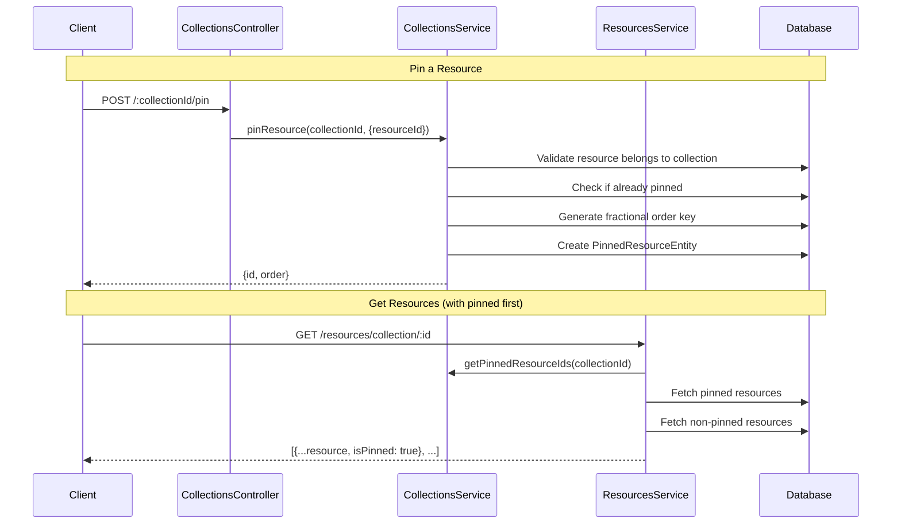

# Pinned Resources Feature

A feature to "pin" resources at the top of a collection feed, similar to pinning posts in social networks.

## Data Flow

## Backend Modules

### Entity

- `PinnedResourceEntity`: Join table between `Collection` and `Resource` with `order` column (fractional indexing)

### DTOs

- `PinResourceDto`: `{ resourceId: string }`
- `ReorderPinnedResourceDto`: `{ newOrder: string }`

### Service Methods (`CollectionsService`)

- `pinResource(collectionId, dto)`: Pin resource to collection (validates ownership)
- `unpinResource(collectionId, resourceId)`: Remove pin
- `reorderPinnedResource(pinnedId, dto)`: Reorder pinned resources
- `findPinnedResources(collectionId)`: List pinned resources
- `getPinnedResourcesInfo(collectionId)`: Helper for ResourcesService

### Controller Endpoints

| Method   | Endpoint                           | Description             |
| -------- | ---------------------------------- | ----------------------- |
| `POST`   | `/:collectionId/pin`               | Pin a resource          |
| `DELETE` | `/:collectionId/unpin/:resourceId` | Unpin a resource        |
| `PATCH`  | `/pinned/:pinnedId/reorder`        | Reorder pinned resource |

### Modified Behavior

- `ResourcesService.findResources()`: Returns response with `pinnedResources` array (always first) and paginated `resources` array
- `ResourcesService.findPinnedResourcesWithData()`: Removed to avoid circular dependency
